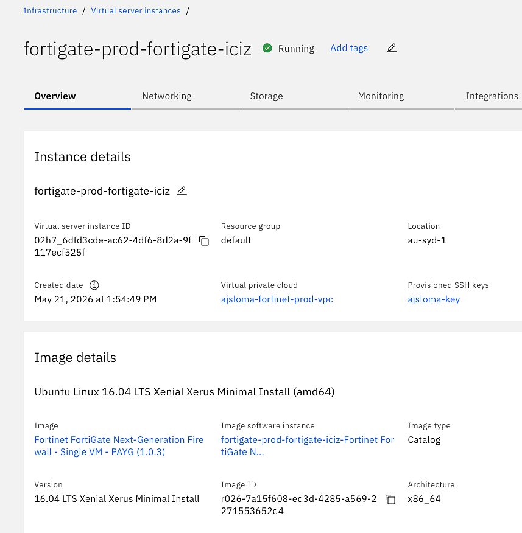
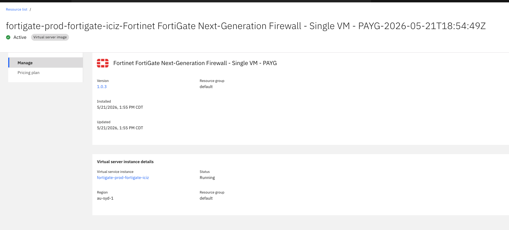
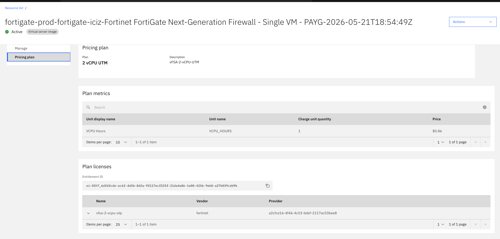
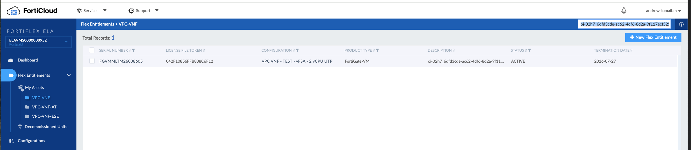

---

copyright:
  years: 2026
lastupdated: "2026-09-29"

keywords: VNF license service, FortiGate license check, software attachment, entitlement, license service verification

subcollection: licensed-firewall

content-type: troubleshoot

---

{{site.data.keyword.attribute-definition-list}}

# Why doesn't my FortiGate instance show a valid license entitlement?
{: #troubleshoot-check-vnf-license-service}
{: troubleshoot}
{: support}

After deployment, the FortiGate VM instance does not show a valid license entitlement from the VNF License Service.
{: shortdesc}

The FortiGate VM license shows as invalid, or it is unclear whether the instance was provisioned with a license through the VNF License Service and whether the license entitlement is correctly associated with the instance.
{: tsSymptoms}

The VNF License Service is an internal service with no direct visibility in the IBM Cloud console, catalog, API, or CLI. License entitlements are associated with a virtual server instance through a software attachment, which is visible through the virtual server instance details in the IBM Cloud console.
{: tsCauses}

Try the following steps to verify that the instance is using the VNF License Service:
{: tsResolve}

1. In the [IBM Cloud console](/login), navigate to **Infrastructure > Compute > Virtual server instances** and open your FortiGate VM instance.

1. On the instance overview page, scroll to **Image details**. Confirm that the image is the Fortinet-VM image.

   {: caption-side="bottom"}
   {: caption="Virtual server instance overview showing Instance details and Image details"}

1. Click the software instance link shown under the image details. Confirm that the product and pricing plan appear.

   {: caption-side="bottom"}
   {: caption="Software instance details showing product name and pricing plan"}

1. In the software instance details, confirm that a pricing plan and an entitlement ID are shown. The entitlement ID is the unique identifier that the VNF License Service stores in the FortiFlex record for this instance.

   {: caption-side="bottom"}
   {: caption="Pricing plan details showing Plan licenses and Entitlement ID"}

1. (Optional) Cross-reference the entitlement ID in the Fortinet FortiFlex portal. Log in to [FortiCloud](https://support.fortinet.com){: external}, navigate to **Flex Entitlements**, and select the **VPC-VNF** asset folder. Confirm that a record exists with a matching entitlement ID, a status of **ACTIVE**, and the correct product type and configuration.

   {: caption-side="bottom"}
   {: caption="FortiFlex portal showing an active VPC-VNF entitlement record"}

1. If no software attachment or entitlement is shown, the instance was not provisioned through the IBM Cloud catalog automation. Delete the instance and deploy it again by using the FortiGate VM offering in the [IBM Cloud catalog](/catalog){: external}.

1. If a software attachment is present but the FortiGate VM license still shows as invalid, see [Why is the FortiGate license not active after deployment?](/docs/licensed-firewall?topic=licensed-firewall-troubleshoot-licensed-firewall).
