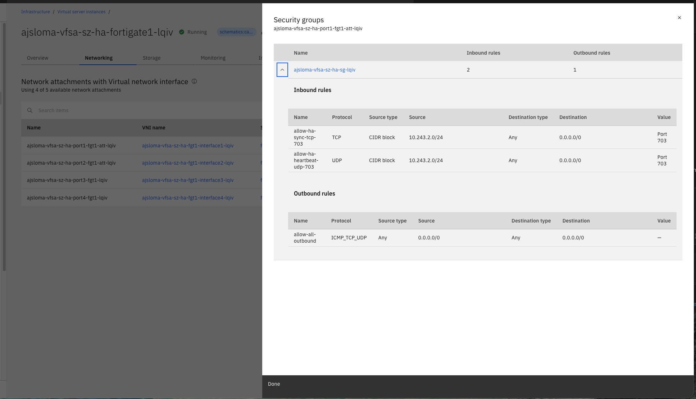

---

copyright:
  years: 2026
lastupdated: "2026-09-29"

keywords: FortiGate HA sync, HA synchronization, HA heartbeat, FortiGate cluster, passive node, out of sync, license invalid

subcollection: licensed-firewall

content-type: troubleshoot

---

{{site.data.keyword.attribute-definition-list}}

# Why is HA synchronization failing after deployment?
{: #troubleshoot-ha-sync}
{: troubleshoot}
{: support}

After you deploy an HA Single Zone or HA Cross Zone FortiGate VM pair, the HA cluster fails to synchronize or the passive node does not appear in the cluster.
{: shortdesc}

The FortiGate web console or CLI shows the passive node as out of sync, missing from the cluster, or in a standalone state.
{: tsSymptoms}

HA synchronization failures are typically caused by:
{: tsCauses}

- The security group is blocking traffic between the FortiGate VM `port3` (HA heartbeat) interfaces.
- The static IP addresses or subnets provided for `port3` are incorrect.
- The HA heartbeat subnet does not have connectivity between zones (cross-zone deployments).
- The secondary node has an invalid license. An unlicensed secondary node cannot sync with the primary.

Try the following steps to resolve the issue:
{: tsResolve}

1. Verify security group rules. Confirm that the automatically created security group includes inbound rules that allow traffic from both FortiGate VM `port3` IP addresses. For HA Single Zone, the rules allow TCP/UDP port 703 from the HA heartbeat subnet (`SUBNET_3`). For HA Cross Zone, the rules allow all protocols from the specific `port3` IPs of each node.

   {: caption-side="bottom"}
   {: caption="Security group showing HA heartbeat inbound rules for TCP and UDP port 703"}

1. Check HA status from the CLI. Log in to the FortiGate VM and run the following command to verify the HA cluster state:

   ```sh
   get system ha status
   ```
   {: pre}

   Review the **Configuration Status** section of the output. The following example shows an out-of-sync secondary node:

   ```screen
   Configuration Status:
       FGVMMLTM26011901(updated 1 seconds ago): in-sync
       FGVMEVC-QMMMQAEA(updated 1 seconds ago): out-of-sync
   ```
   {: screen}

   Both nodes must show `in-sync` for the cluster to be operating correctly. If the secondary shows `out-of-sync`, continue with the remaining steps.

1. Verify static IP assignments. Confirm that the `FGT1_STATIC_IP_PORT3` and `FGT2_STATIC_IP_PORT3` values used during deployment match the actual IP addresses assigned to the `port3` interfaces on each FortiGate VM.

1. Check the license status on both nodes. Run `get system status` on each FortiGate VM node and confirm that `License Status: Valid` appears on both the primary and secondary. If the secondary node shows `Invalid`, resolve the licensing issue first. An unlicensed secondary node cannot sync with the primary. For more information, see [Why is the FortiGate license not active after deployment?](/docs/licensed-firewall?topic=licensed-firewall-troubleshoot-licensed-firewall).

1. If HA synchronization is still failing after completing these steps, [open an IBM support case](/unifiedsupport/cases/add){: external}. Include the virtual server instance IDs, VPC ID, Schematics workspace ID, the output of `get system ha status`, and the output of `get system status` from each node.
