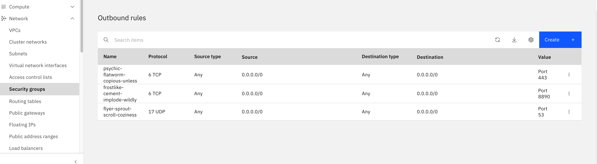
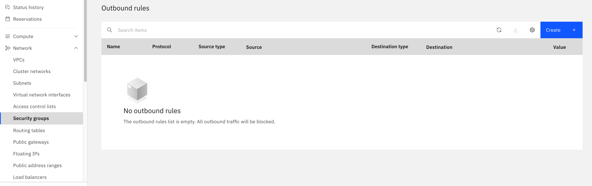

---

copyright:
  years: 2026
lastupdated: "2026-09-28"

keywords: FortiGate license grace period, FortiFlex grace period, FortiGuard connectivity, license expiring, license warning, license invalid

subcollection: licensed-firewall

content-type: troubleshoot

---

{{site.data.keyword.attribute-definition-list}}

# Why is my FortiGate license showing as invalid, warning, or in a grace period?
{: #troubleshoot-license-grace-period}
{: troubleshoot}
{: support}

The FortiGate FortiFlex license shows a status of `Invalid`, `Warning`, or `Grace Period` instead of `Valid`.
{: shortdesc}

The FortiGate CLI or FortiGuard subscription service shows a license status of `Warning`, `Grace Period`, or `Invalid`. FortiGuard subscription services may be degraded or unavailable, and the instance may have stopped processing traffic.
{: tsSymptoms}

The FortiFlex license requires periodic contact with Fortinet's FortiGuard servers over the public internet to remain valid. The FortiGate VM checks its license against FortiGuard every 60 minutes. A single failed check sets the license status to `Warning`. If connectivity is not restored within 30 days, the license becomes `Invalid`, the VM stops processing traffic, and the management UI becomes inaccessible. For more information, see [FortiFlex Grace Period](https://docs.fortinet.com/document/fortigate/8.0.0/administration-guide/416169/vm-license){: external}. Common causes include:
{: tsCauses}

- The egress rules on the public interface security group were removed or modified, blocking outbound traffic to FortiGuard.
- The floating IP was detached from `port1`, removing the instance's route to the public internet.
- For Active/Passive HA Single Zone deployments, the public gateway was removed from the public subnet, leaving the secondary node without internet access.
- A Network Access Control List (NACL) applied to the public subnet is blocking egress traffic on UDP 53, TCP 443, or TCP 8890.

Try the following steps to restore connectivity and resolve the issue:
{: tsResolve}

1. Check whether the FortiGate can reach FortiGuard. Run the following commands on the FortiGate CLI:

   ```sh
   diagnose debug application update -1
   diagnose debug enable
   execute update-now
   ```
   {: pre}

   A successful result ends with `UPDATE successful`, as shown in the following example:

   ```screen
   IBM-HA-Active(Primary) (Interim)# execute update-now
   upd_daemon[1905]-Received update request from pid=24045
   ...
   upd_install_pkg[1592]-FCNI000(fcni) installed successfully
   upd_install_pkg[1565]-FFDB031 is up-to-date
   ...
   do_update[852]-UPDATE successful
   ```
   {: screen}

   If the output shows repeated `SETUP failed` lines, as shown in the following example, the FortiGate cannot reach FortiGuard:

   ```screen
   IBM-HA-Active(Primary) (Interim)# execute update-now
   upd_daemon[1905]-Received update request from pid=8956
   do_setup[342]-Starting SETUP
   upd_act_setup[131]-Trying Setup, fmg=0
   upd_act_setup[142]-Failed receiving setup response, fmg=0, ret=-1
   upd_act_setup[154]-Setup failed, fmg=0.
   do_setup[346]-SETUP failed
   upd_daemon[2056]-Disabling remaining actions 1
   ...
   ```
   {: screen}

1. Identify the error code. Run the following command to see the response code from FortiGuard:

   ```sh
   diagnose hardware sysinfo vm full
   ```
   {: pre}

   The following example shows the output:

   ```screen
   UUID:     72038ad439ca48e19108a95895728abf
   valid:    1
   status:   2
   code:     502
   warn:     6
   copy:     0
   received: 4355975754
   warning:  4356023674
   ```
   {: screen}

   A `code` value of `502` indicates that FortiGuard is returning an error. The `warn` field increments with each failed check; when it reaches the 30-day threshold the license becomes `Invalid`. A non-zero `warn` value means connectivity failures are already being counted. For a detailed explanation of every field, see [VM license — display license information from FortiGuard](https://docs.fortinet.com/document/fortigate/8.0.0/administration-guide/416169/vm-license#ipt-to-display-license-information-from-fortiguard){: external}.

1. Check the security group egress rules. In the [IBM Cloud console](/login), open the security group attached to the public interface (`port1`) and confirm that it includes the following egress rules. If any are missing, add them back. For more information, see [Public connectivity requirements](/docs/licensed-firewall?topic=licensed-firewall-understanding-fortigate-licensing#licensing-public-connectivity).

   | Protocol | Port | Destination |
   |---|---|---|
   | UDP | 53 | `0.0.0.0/0` |
   | TCP | 443 | `0.0.0.0/0` |
   | TCP | 8890 | `0.0.0.0/0` |
   {: caption="Required egress rules for FortiGuard connectivity" caption-side="bottom"}

   The following image shows a security group configuration with the required egress rules in place:

   {: caption-side="bottom"}
   {: caption="Security group with required egress rules for FortiGuard connectivity"}

   The following image shows a security group configuration that is missing the required egress rules:

   {: caption-side="bottom"}
   {: caption="Security group missing the required egress rules for FortiGuard connectivity"}

1. Verify that the floating IP and public gateway are attached. Each FortiGate node must have a route to the public internet. Confirm that a floating IP is attached to `port1` on each node. For Active/Passive HA Single Zone deployments, also confirm that a public gateway is attached to the public subnet for the secondary node. For more information, see [Public connectivity requirements](/docs/licensed-firewall?topic=licensed-firewall-understanding-fortigate-licensing#licensing-public-connectivity).

1. Check any Network Access Control Lists (NACLs). If a NACL is applied to the public subnet, confirm that it includes egress rules that allow outbound traffic to FortiGuard on UDP 53, TCP 443, and TCP 8890. Add the missing rules if any are blocked.

1. After restoring connectivity, re-run `execute update-now` to confirm that the update succeeds. The grace period clears automatically once FortiGuard successfully validates the license.

1. If the issue persists after restoring connectivity, [open an IBM support case](/unifiedsupport/cases/add){: external}. Include the virtual server instance ID, the output of `diagnose hardware sysinfo vm full`, and the output of `execute update-now`.
