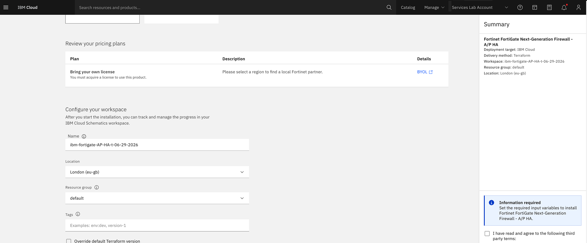
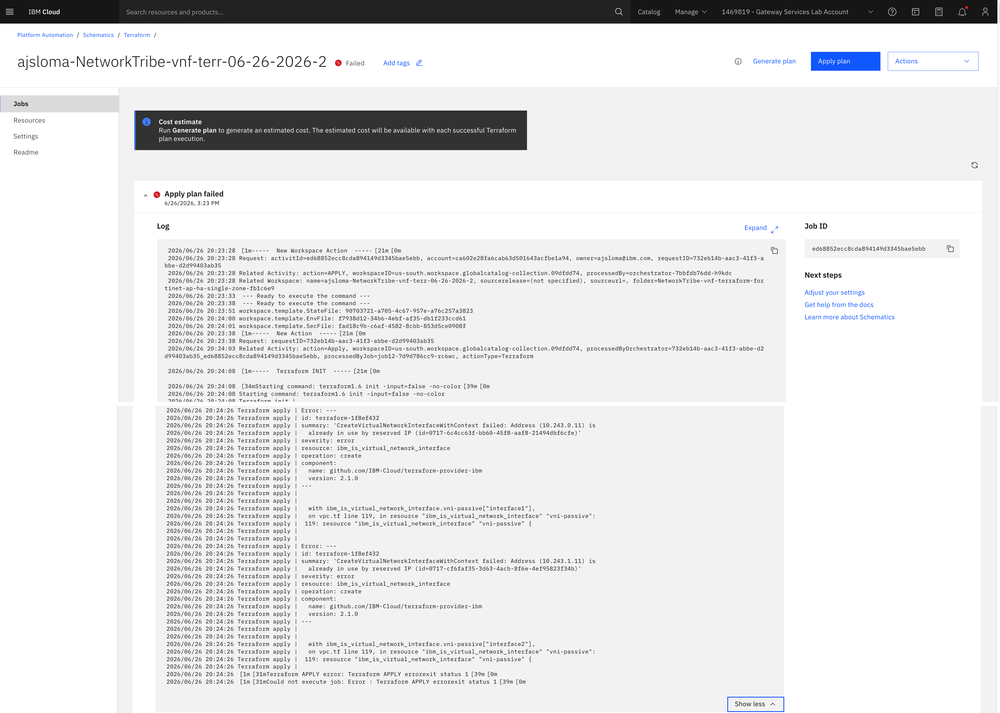

---

copyright:
  years: 2026
lastupdated: "2026-09-25"

keywords: FortiGate deployment failed, Schematics error, Terraform failed, cart creation failed, firewall deployment error

subcollection: licensed-firewall

content-type: troubleshoot

---

{{site.data.keyword.attribute-definition-list}}

# Why did my FortiGate deployment fail in Schematics?
{: #troubleshoot-schematics-deployment}
{: troubleshoot}
{: support}

A FortiGate firewall deployment started from the IBM Cloud catalog did not complete successfully.
{: shortdesc}

The IBM Cloud Schematics workspace log shows one or more Terraform errors, the deployment stops before finishing, or the log completes without displaying both **Terraform commands successful** and **Cart creation successful**.
{: tsSymptoms}

Deployment failures in Schematics can have several causes:
{: tsCauses}

- One or more required input variables were missing or invalid (for example, an incorrect VPC name, subnet ID, or SSH key name).
- The IBM Cloud API key provided does not have sufficient IAM permissions to create VPC resources.
- A required resource (VPC, subnet, security group, or SSH key) does not exist in the target region or zone.
- A resource quota limit was reached in the target region (for example, maximum virtual server instances, floating IPs, or public gateways).
- A transient IBM Cloud platform error occurred during provisioning.

Try the following steps to resolve the issue:
{: tsResolve}

1. Review the Schematics workspace log. Open the workspace that was created for your deployment. If you need to find the workspace manually, navigate to **IBM Cloud Menu > Platform Automation > Schematics > Terraform** and select your workspace.

   {: caption-side="bottom"}
   {: caption="Configure your workspace in the IBM Cloud catalog"}

   Click **Jobs** and select the most recent apply job. Scroll to the end of the log and look for the specific Terraform error message. The error message typically identifies which resource failed and why.

   {: caption-side="bottom"}
   {: caption="Schematics log showing a Terraform apply failure"}

1. Check your input variables. In the workspace, click **Settings** and review the values provided for all input variables. Verify that VPC names, subnet IDs, security group IDs, SSH key names, and region and zone values are correct and exist in your IBM Cloud account.

1. Verify IAM permissions. Ensure that the IBM Cloud API key used for deployment has at minimum the **Editor** role on the VPC Infrastructure service and the **Operator** role on the Schematics service. For a full list of required permissions, see [Shared responsibilities for FortiGate licensed firewall](/docs/licensed-firewall?topic=licensed-firewall-shared-responsibilities).

1. Check resource quotas. In the [IBM Cloud console](/login), navigate to **Manage > Account > Quotas** and verify that you have not reached the limit for virtual server instances, floating IPs, or security groups in the target region.

1. If the log shows a public gateway quota error similar to the following example, resolve the quota conflict before retrying:

   ```screen
   Error: ---
   summary: 'CreatePublicGatewayWithContext failed: Creating a new public gateway will
     put the user over quota. Allocated: 1, Requested: 1, Quota: 1'
   resource: ibm_is_public_gateway
   ```
   {: screen}

   The Active/Passive Single Zone deployment requires a public gateway on the public subnet so that the secondary node can reach FortiGuard. If you already have a public gateway in the same zone, you can either specify the existing gateway ID in the `PUBLIC_GATEWAY_ID` input variable, or delete the existing gateway and retry the deployment.

1. Retry the deployment by clicking **Actions > Apply plan** in the Schematics workspace to run the Terraform automation again without modifying your inputs. Review the log again after the job completes.

1. If the workspace is in a partially provisioned state, click **Actions > Destroy resources** to clean up any resources that were created, then place a new order from the [IBM Cloud catalog](https://cloud.ibm.com/catalog){: external} with corrected inputs.

1. If the deployment continues to fail after completing these steps, [open an IBM support case](https://cloud.ibm.com/unifiedsupport/cases/add){: external}. Include the Schematics workspace ID, the job ID of the failed apply, and the relevant log output.
