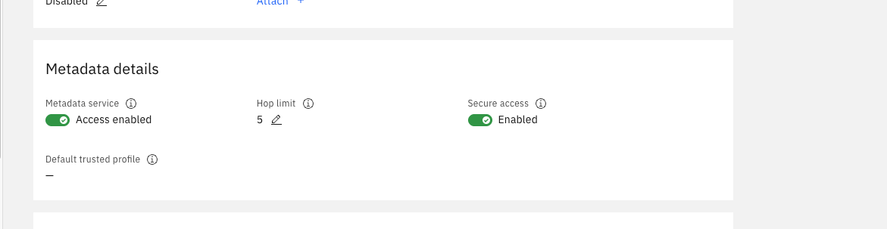

---

copyright:
  years: 2026
lastupdated: "2026-09-04"

keywords: FortiGate license not active, license error, fortigate license, metadata service, cloud-init license, cloud-init logs, FortiFlex, license injection

subcollection: licensed-firewall

content-type: troubleshoot

---

{{site.data.keyword.attribute-definition-list}}

# Why is the FortiGate license not active after deployment?
{: #troubleshoot-licensed-firewall}
{: troubleshoot}
{: support}

After deploying a FortiGate instance, the license status shows as inactive or unlicensed in the FortiGate web console.
{: shortdesc}

When you log in to the FortiGate web console and navigate to **System > FortiGuard**, the license status is shown as **Invalid**, **Expired**, or **Not registered**, and FortiGuard services are not available.
{: tsSymptoms}

The FortiGate license is retrieved and installed automatically during initial startup. FortiOS calls the IBM Cloud instance metadata [authentication APIs](https://cloud.ibm.com/docs/apis/vpc-identity/latest#create-identity-token){: external} to obtain an identity token, then calls the software attachments endpoint to retrieve the FortiFlex license key. It installs the key and restarts, then contacts Fortinet FortiCloud to complete validation. License activation can fail for several reasons:
{: tsCauses}

- The Instance Metadata Service was not enabled at deployment time.
- Cloud-init did not complete successfully, preventing the license retrieval script from running.
- The instance could not reach the Fortinet FortiFlex platform during initial startup, for example due to a missing floating IP, public gateway, or a security group blocking outbound traffic on UDP 53, TCP 443, or TCP 8890.
- The FortiGate instance was deployed without using the IBM Cloud Schematics automation, which handles license provisioning.

Try the following steps to resolve the issue:
{: tsResolve}

1. Verify that the Instance Metadata Service and Secure options are enabled. In the [IBM Cloud console](/login), navigate to **Infrastructure > Compute > Virtual server instances** and open your FortiGate instance. Scroll to the bottom of the overview page and confirm that **Metadata service** is set to **Enabled** and that the **Secure** option is also enabled. If either is disabled, enable it and restart the instance.

   {: caption-side="bottom"}
   {: caption="VSI Metadata details showing Metadata service and Secure access enabled"}

1. Review the Schematics workspace log. Open the Schematics workspace that was used to deploy the firewall and review the Terraform log for errors. Confirm that both **Terraform commands successful** and **Cart creation successful** are displayed at the end of the log.

1. Check outbound connectivity from the FortiGate. The FortiGate must be able to reach Fortinet licensing servers on the internet. Verify that the VPC has a public gateway attached to the subnet used by `port1`, or that a floating IP is assigned to `port1`. Also confirm that the security group on `port1` allows egress traffic on UDP 53, TCP 443, and TCP 8890. From the FortiGate CLI, run:

   ```sh
   execute ping guard.fortinet.net
   ```
   {: pre}

   If the ping fails, check VPC routing and security group outbound rules.

1. Review the FortiOS cloud-init log. Run the following command on the FortiGate CLI to see the detailed license injection log:

   ```sh
   diagnose debug cloudinit show
   ```
   {: pre}

   A successful injection ends with `VM license install succeeded. Will reboot firewall.`, as shown in the following example:

   ```screen
   >> 2026-06-26 10:36:56 IBM metadata swat found entitlement, key: ***, sku: fortiflex, vendor name: fortinet
   >> 2026-06-26 10:36:56 IBM metadata swat successfully parsed entitlement
   >> 2026-06-26 10:36:56 Trying to install vmlicense ...
   >> 2026-06-26 10:36:56 License-token:***
   VM license install succeeded. Will reboot firewall.
   ```
   {: screen}

   If the log shows `Failed to request forticare license` lines, as shown in the following example, the instance could not reach FortiCloud during the initial boot:

   ```screen
   >> 2026-06-26 10:36:56 Trying to install vmlicense ...
   >> 2026-06-26 10:36:56 License-token:***
   >> 2026-06-26 10:37:27 Failed to request forticare license 28.
   >> 2026-06-26 10:37:27 Forticare response error 58.
   >> 2026-06-26 10:38:27 Failed to request forticare license 28.
   >> 2026-06-26 10:38:42 Failed to request forticare license -1.
   >> 2026-06-26 10:39:44 Failed to install license-token:-1
   ```
   {: screen}

   Resolve the connectivity issue described in the previous step, then stop and start the virtual server instance to retrigger the injection.

1. Restart the FortiGate instance. If the Instance Metadata Service is now enabled and outbound connectivity is confirmed, stop and start the virtual server instance to trigger cloud-init to run again. License validation by FortiCloud typically completes within a few minutes but can take up to an hour.

1. If the license is still not active after completing these steps, [open a support case](https://cloud.ibm.com/unifiedsupport/cases/add){: external}. Include the virtual server instance ID, VPC ID, Schematics workspace ID, the output of `diagnose debug cloudinit show`, and the relevant Schematics log output.
